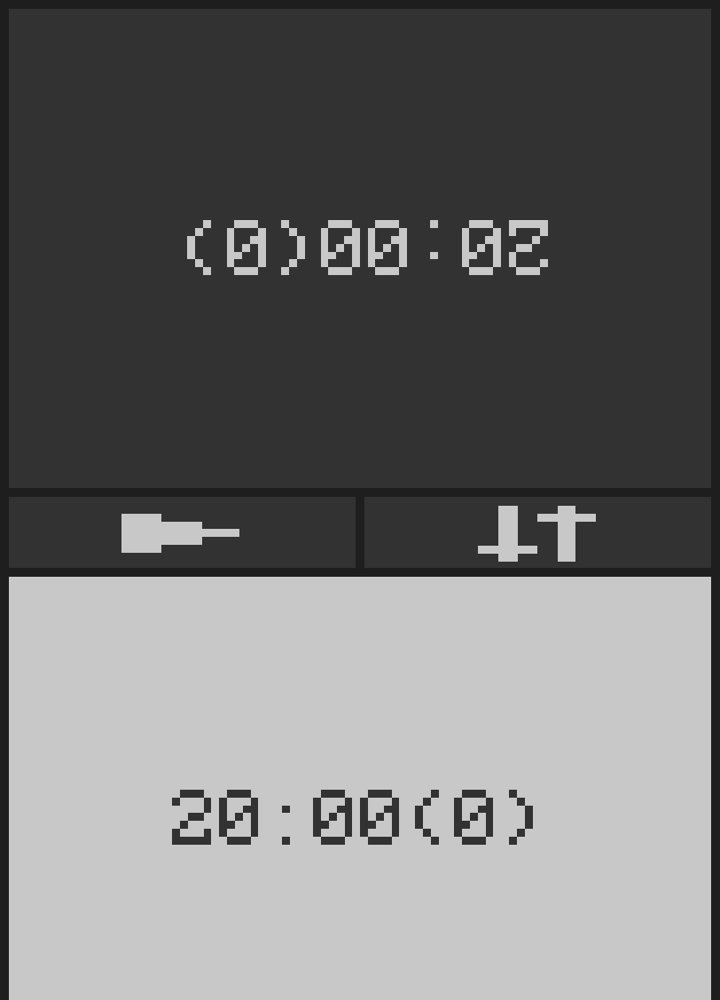

# Chess Timer

This is a small SDL app that simply functions as a bare-bones chess clock (I named it before I knew the terminology.)

It primarily targets the [PinePhone](https://pine64.org/devices/pinephone/), but it can be run just about anywhere that SDL will build.

## Screenshots:

Time Input:

Timer:

## Features:
* Adjustable time
* Moves counter
* Mirrored time readouts
* Swappable sides
* Nice colors
    * Yellow when under 1 minute
    * Red when a flag drops

## Usage:
The app is meant to be used like a typical analogue or digital timer, run the app, select the time you want on the timer, and then place the phone besides the chess board. If you want, you can use the button on the right side middle of the screen to swap the colors. You can of course, simply rotate the phone as well.
